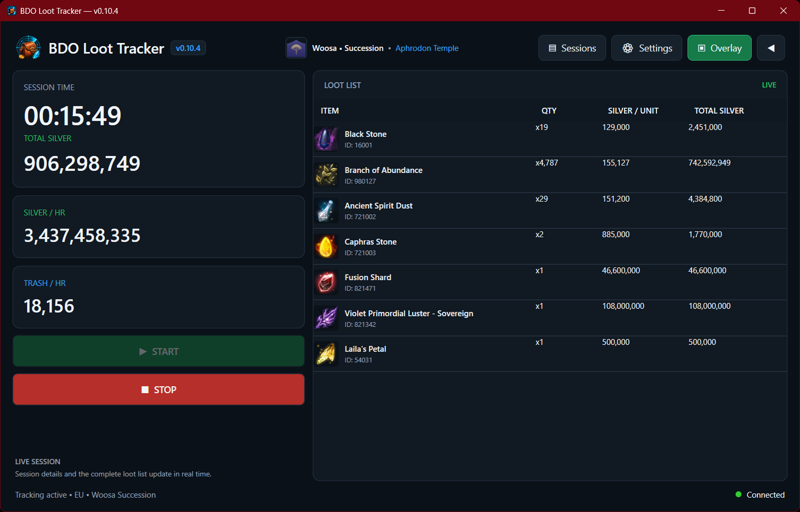
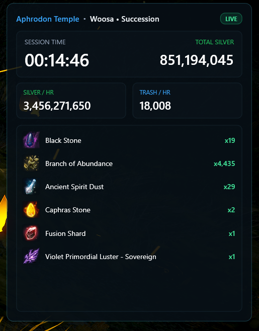
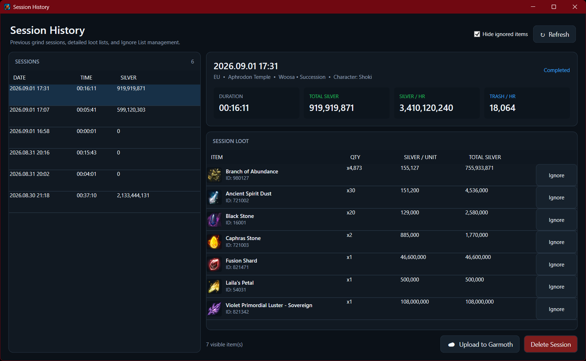
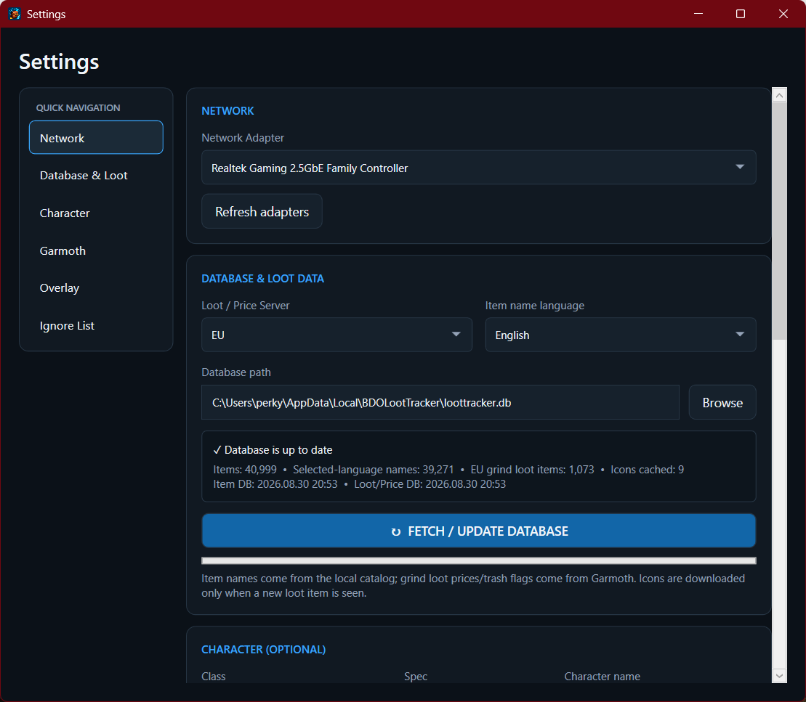
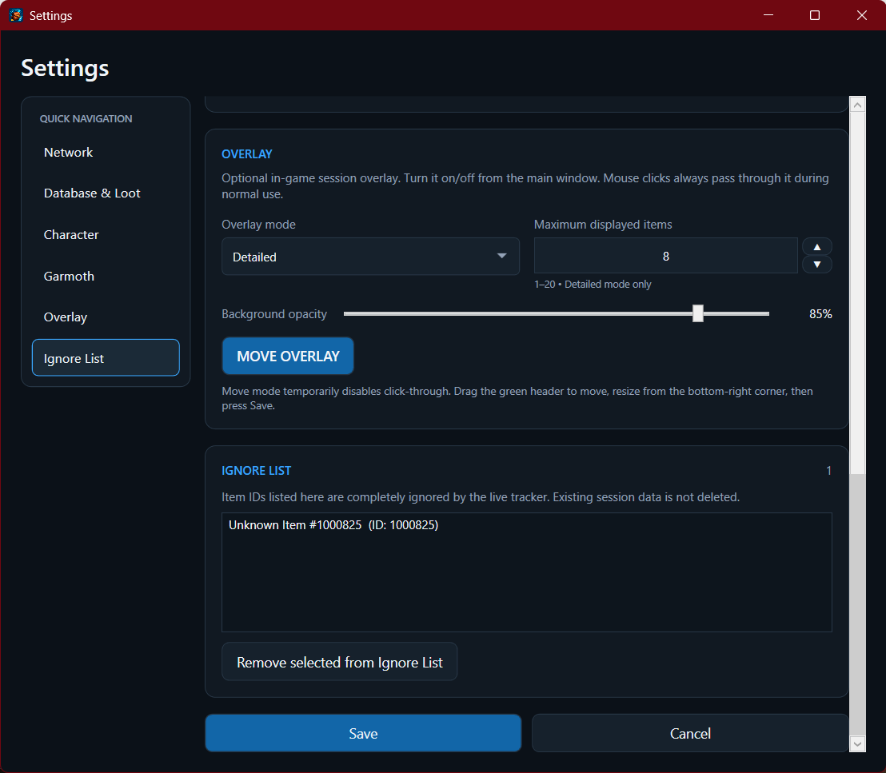

# BDO Loot Tracker

A Windows desktop loot tracker for Black Desert Online.

BDO Loot Tracker uses **Npcap** to passively capture Black Desert Online network traffic and process the relevant incoming game data in real time.

[Download the latest release](https://github.com/Shoki697/BDOLootTracker/releases)

---

## Requirements

- Windows 10/11 x64
- Npcap installed on the PC

Npcap is required for packet capture.  
[Download Npcap](https://npcap.com/)

### Installation

1. Download the latest `Setup.exe` from GitHub Releases.
2. Install Npcap if it is not already installed.
3. Install and start BDO Loot Tracker.

### First Run

Open **Settings**, select your network adapter, market region and item language, then run **Fetch / Update Database**.  
After that, press **Start** to begin tracking.

---

## Features

- Real-time loot tracking
- Automatic grind spot detection
- Silver/hr and Trash/hr statistics
- Detailed and compact in-game overlay
- Session history
- Garmoth Grind Tracker upload
- Market prices and item icons
- Item Ignore List
- Automatic updates

---

## Main Window

Track your current grinding session with live loot, silver and trash statistics.  
The current class and detected grind spot are shown at the top.

---

## In-Game Overlay

Use the optional click-through overlay to keep your session statistics visible while playing.  
Detailed and Compact modes are available, and the overlay can be freely positioned and resized.

---

## Session History

Previous grinding sessions are saved automatically and can be reviewed later.  
Sessions can also be uploaded directly to the Garmoth Grind Tracker.

---

## Settings

Configure your network adapter, market region, character, overlay and Garmoth integration from one place.

---

## Ignore List

Items added to the Ignore List are excluded from future live tracking and calculations.

---

## Garmoth Integration

Add your Garmoth API token under **Settings → Garmoth**.  
Completed sessions can then be uploaded from the **Sessions** window.

---

## Disclaimer

BDO Loot Tracker is an unofficial community project and is not affiliated with or endorsed by Pearl Abyss.  
Use of third-party tools with Black Desert Online is subject to Pearl Abyss' Terms of Service and policies.
