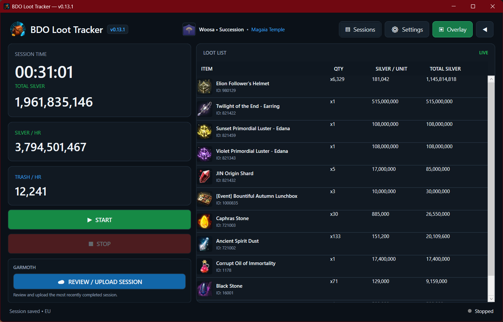
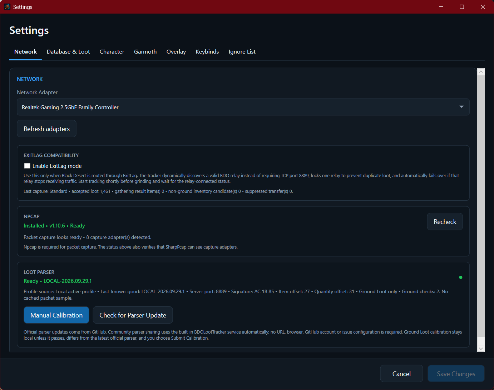
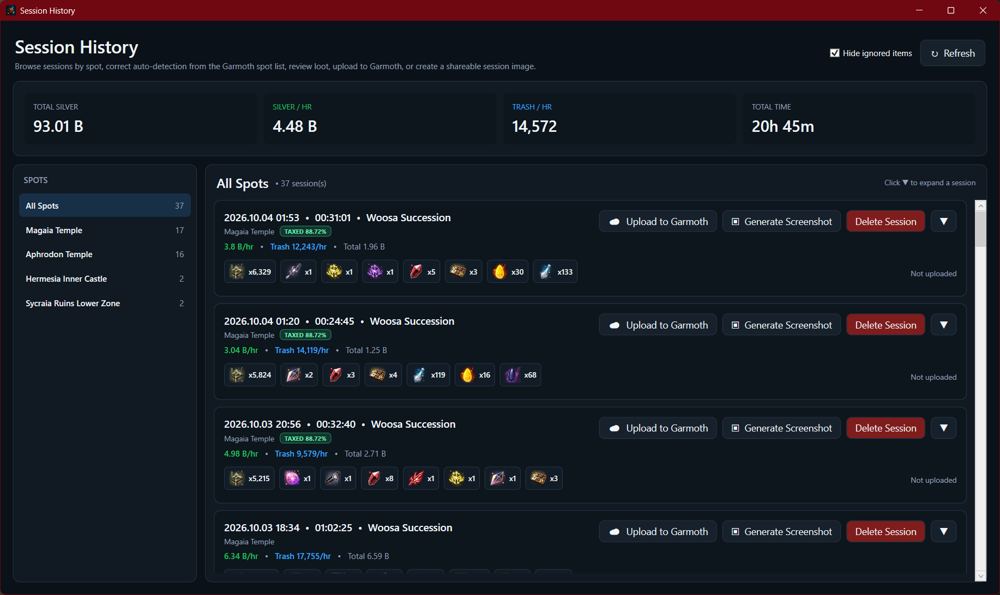
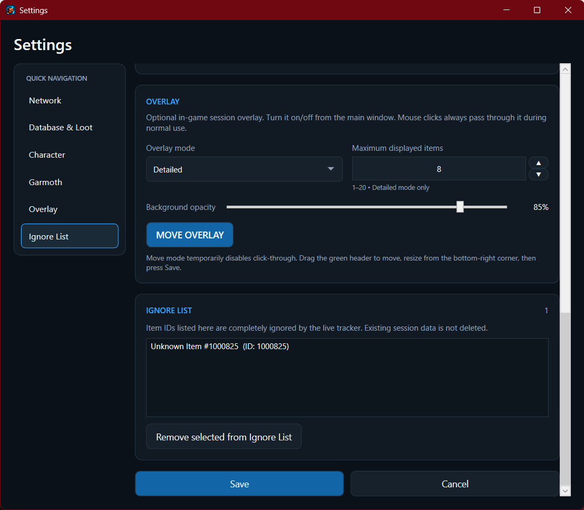
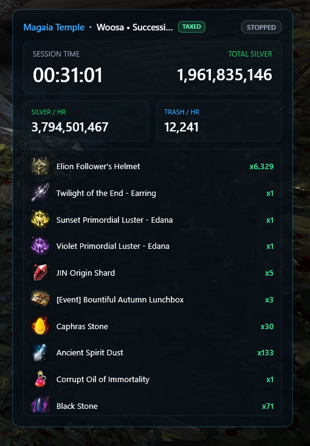

# BDO Loot Tracker
A Windows desktop loot tracker for **Black Desert Online**. BDO Loot Tracker uses **Npcap** to passively read the relevant incoming game traffic and track loot in real time without OCR for normal grind sessions.
The general workflow is similar in concept to **IKUSA**: start the tracker before a grind or gathering session, let it detect loot automatically in real time, then review the completed session and optionally upload it to Garmoth.

[Download the latest release](https://github.com/Shoki697/BDOLootTracker/releases)

## Requirements
- Windows 10/11 x64
- [Npcap](https://npcap.com/) installed

Npcap is required for packet capture. The capture path is read-only; BDO Loot Tracker does not inject or modify game traffic.

## Installation
1. Download the latest `BDOLootTracker-win-Setup.exe` from GitHub Releases.
2. Install Npcap if it is not already installed.
3. Start BDO Loot Tracker.
4. Open **Settings → Network** and select the network adapter used by BDO.
5. Open **Settings → Database & Loot**, select the correct region/language, then run **Fetch / Update Database**.
6. Press **START** before grinding or gathering.

## Garmoth integration
Add your Garmoth API token under **Settings → Garmoth**. Completed sessions can be uploaded from the main window or Session History.
Before upload, the review window lets you:

- Review tracked loot and quantities;
- Choose/correct the exact Garmoth spot with a searchable selector;
- Reuse the saved session Drop Rate metadata;
- Keep the original packet-tracked session unchanged while adjusting upload quantities.

For auto-detected **Gathering** sessions, choosing the exact Garmoth gathering spot before upload is intentional.
## Session History

Sessions are stored locally and can be reviewed by spot. Session History supports:

- Expandable loot details;
- Silver/hr and Trash/hr summaries;
- Searchable manual spot assignment;
- Garmoth upload status;
- Drop Rate metadata;
- Shareable session screenshots;
- Ignore List management for unwanted items.

## Overlay
The optional overlay can stay visible over BDO and supports:

- Detailed / Compact layouts
- opacity control
- configurable maximum item count
- sorting by quantity, time, total value or unit value
- position reset and saved placement
- global show/hide hotkey

---

## Market Tax
Under **Settings → Character**, BDO Loot Tracker can estimate Central Market collection value using Value Pack, Rich Merchant's Ring and Family Fame bonuses. Tax adjustment is optional and affects only local session totals / Silver per hour for non-trash market loot. Trash/vendor loot stays untaxed, and Garmoth uploads keep the original raw loot values. Taxed sessions are marked with a small **TAXED** badge in Session History, screenshots and the overlay.
